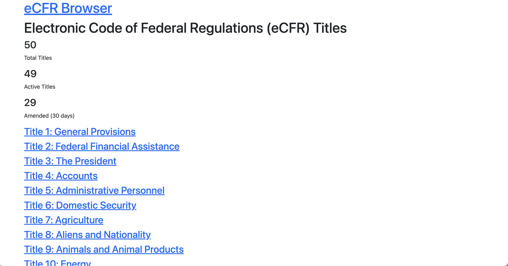

# eCFR Take Home Test Documentation

## Technical Implementation

- Handle title synchronization with the eCFR API
- Ensures data consistency through transactions
- Processes chapters, parts, subparts, and sections
- Clean, minimal UI focused on content
- Efficient data synchronization with eCFR API
- Hierarchical display of regulatory structure

## UI Screenshots

## Project Duration
- Initial setup and API integration: 3 hours
- Service implementation: 3 hours
- UI development and refinement: 1 hour
- Total time: 7 hours

## Areas for Improvement
1. Add caching for frequently accessed data
2. Implement background jobs for data synchronization
3. Add search functionality across titles and sections
4. Enhance error handling and user feedback
5. Implement custom metric for regulatory analysis:
   - Compare similar or duplicate regulations across multiple Titles
   - Identify duplicate or near-duplicate rules across agencies
   - Find opportunities for condensing into shared global policies
   - Detect outdated or inconsistent language that could indicate copy-paste drift or unclear scope

## Personal Reflection
This assignment was fun. I'm going to keep working on once the interview ends. 

The ~4-hour time limit was tight for me due to work and life obligations, so I ended up spending closer to 7 hours total, maybe more. 

I focused on the API ingestion and metric exposure pipeline first. That left less time for frontend polish, testing, or custom metrics.

Parsing and normalizing the eCFR API is time-consuming but interesting. Having recently built a similar parser at work helped me move faster here.

